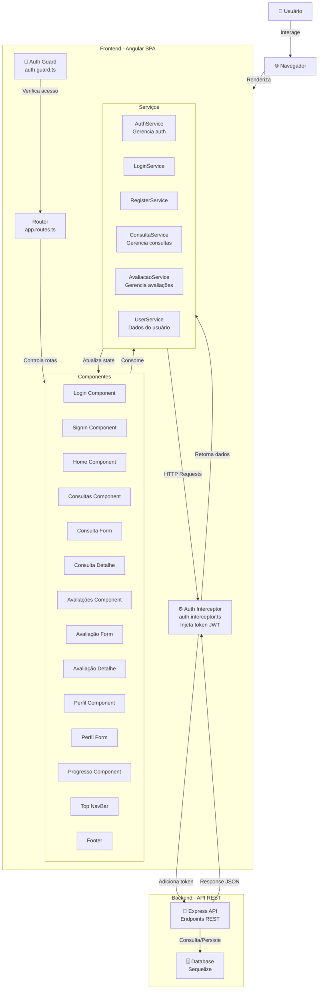

# ⚡ Projeto Angular SPA

Este projeto é uma **Single Page Application (SPA)** desenvolvida com [Angular](https://angular.io/), seguindo boas práticas de arquitetura, organização modular e uso de serviços para comunicação com APIs REST.

O projeto está configurado para funcionar juntamente com o projeto [backend em Express com Sequelize - API RESTful](https://github.com/carloshdario/backend-saude-mental).

## 🚀 Tecnologias Utilizadas

- [Angular CLI](https://angular.io/cli)
- [TypeScript](https://www.typescriptlang.org/)
- [RxJS](https://rxjs.dev/)
- [CSS](https://developer.mozilla.org/pt-BR/docs/Web/CSS/) e [Bootstrap](https://getbootstrap.com/docs/5.3/getting-started/introduction/) para estilização
- [Angular Router](https://angular.io/guide/router)
- [HttpClient](https://angular.io/guide/http)

## 🏗️ Arquitetura do Projeto



## 📁 Estrutura de Pastas

    src/
    ├── app/
    │ ├── core/ # Serviços globais, interceptadores, guards, etc.
    │ ├── shared/ # Componentes, pipes e diretivas reutilizáveis
    │ ├── modules/ # Módulos funcionais (ex: users, auth, dashboard)
    │ ├── app-routing.module.ts # Rotas principais
    │ └── app.component.ts # Componente raiz
    ├── assets/ # Imagens, ícones, fontes
    ├── environments/ # Configurações para diferentes ambientes (dev/prod)
    └── styles/ # Estilos globais

## 🧪 Pré-requisitos

- Node.js (versão 18.19.1 ou maior)
- Angular CLI (versão 19.2.8 ou maior - instale com `npm install -g @angular/cli`)

## ⚙️ Instalação

### 1. Clonar o repositório

```bash
git clone https://github.com/guilherme-henrique-silva/projeto-integrador-1.git
cd projeto-integrador-1
```

### 2. Instalar dependências

```bash
npm install
```

## ▶️ Executando o Projeto

1. Modo de desenvolvimento local:

```bash
ng serve
```

2. Docker:

```bash
# Build da imagem
docker build -t projeto-integrador-1 .

# Rodar o container na porta 4200
docker run -p 4200:80 projeto-integrador-1
```

Acesse no navegador: http://localhost:4200

A aplicação irá automaticamente recarregar quando quaisquer dos seus arquivos forem modificados.

Build de produção:

```bash
ng build --configuration production
```

## 📌 Scripts úteis

| Comando    | Descrição                                   |
| ---------- | ------------------------------------------- |
| `ng serve` | Inicia a aplicação em modo dev              |
| `ng build` | Compila o projeto para produção             |
| `ng lint`  | Roda o linter                               |
| `ng test`  | Executa os testes unitários com Karma       |
| `ng e2e`   | Executa os testes end-to-end com Protractor |

## 🧼 Boas Práticas Implementadas

    ✅ Estrutura modularizada com Core, Shared e Modules
    ✅ Requisições HTTP isoladas em serviços (services)
    ✅ Interceptadores de token (JWT)
    ✅ Guards de rotas para controle de acesso
    ✅ Responsividade e componentização
    ✅ Separação de ambientes (dev/prod)

## 🧪 Testes

Este projeto vem preparado com:

    Karma + Jasmine para testes unitários

    Protractor (ou Cypress, se configurado) para testes e2e

Execute os testes unitários com:

```bash
# Executando diretamente os testes
ng test

# OU usando ChromeHeadless
ng test --browsers ChromeHeadless --watch=false
```

Execute os testes end-to-end (e2e) com:

```bash
ng e2e
```

## 📄 Licença

Este projeto está licenciado sob a licença MIT. Veja o arquivo LICENSE para mais informações.

## 👤 Autor

Desenvolvido por Guilherme Henrique da Silva e Larissa Stecca da Silva para a disciplina de Projeto Integrador I do Eixo de Computação da UNIVESP - Polo Assis (1/2025).

Membros do grupo:

- CARLOS HENRIQUE BATISTA DARIO
- FERNANDA KILL DA SILVA
- GABRIELA HERNANDES DE TOLEDO IUDESNEIDER
- GUILHERME HENRIQUE DA SILVA
- LARISSA STECCA DA SILVA 
- PEDRO HENRIQUE DE OLIVEIRA E OLIVEIRA LIMA
- RAFAEL PRAXEDES ZORZO
- VITOR HUGO SOUZA SILVA
